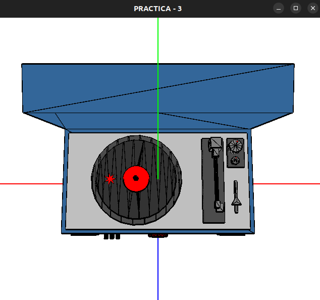
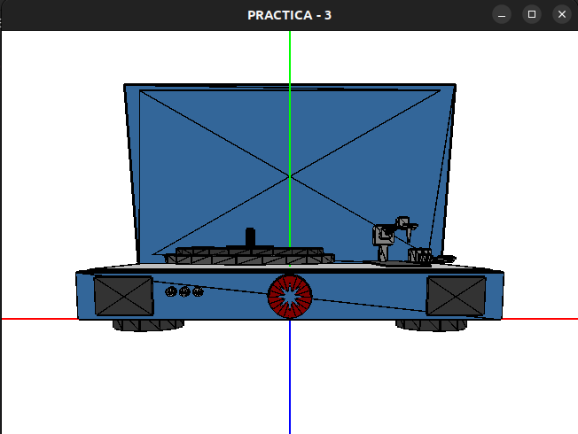

# Práctica 3: Tocadiscos

## Introducción
Este tutorial detalla los controles del proyecto "Tocadiscos" para interactuar con los diferentes elementos y la cámara del tocadiscos.

* Alumna: Blanca Girón Ricoy 

---

### Controles de Cámara

| Tecla                   | Acción                                      |
|-------------------------|---------------------------------------------|
| **Shift + RePag**       | Alejar cámara                               |
| **Shift + AvPag**       | Acercar cámara                              |
| **I**                   | Cámara original                             |
| **P**                   | Cámara de pájaro                            |
| **O**                   | Cámara frontal                              |

### Modos de Visualización

| Tecla                   | Acción                                      |
|-------------------------|---------------------------------------------|
| **1, 2, 3, 4, 5**       | Cambiar modo de visualización               |
| **A**                   | Objeto jerárquico (tocadiscos)        |
| **C**                   | Visualizar figuras                          |
| **X**                   | Visualizar extrusión                        |
| **M**                   | Visualizar montaña                          |
| **S**                   | Iniciar animación (con sonido)              |

### Controles de Velocidad del Disco

| Tecla                   | Acción                                      |
|-------------------------|---------------------------------------------|
| **6**                   | Aumentar velocidad del disco                |
| **7**                   | Disminuir velocidad del disco               |

### Visualización de las partes

| Tecla                   | Acción                                      |
|-------------------------|---------------------------------------------|
| **B**                   | Cambiar a base                              |
| **G**                   | Cambiar a aguja                             |
| **Y**                   | Cambiar a tapa                              |
| **D**                   | Cambiar a deslizador                        |

### Movimientos y Control de Aguja

| Tecla                   | Acción                                      |
|-------------------------|---------------------------------------------|
| **F1**                  | Subir aguja                                 |
| **F2**                  | Bajar aguja                                 |
| **F3**                  | Mover aguja a la derecha                    |
| **F4**                  | Mover aguja a la izquierda                  |
| **F5**                  | Girar ruedas de sonido en sentido antihorario |
| **F6**                  | Girar ruedas de sonido en sentido horario   |

### Controles de la Tapa y el Deslizador

| Tecla                   | Acción                                      |
|-------------------------|---------------------------------------------|
| **F7**                  | Bajar tapa                                  |
| **F8**                  | Subir tapa                                  |
| **F9**                  | Rotar disco (necesita que la aguja esté sobre el disco) |
| **F10**                 | Mover deslizador hacia atrás                |
| **F11**                 | Mover deslizador hacia adelante             |

---

## Salir del Programa

| Tecla                   | Acción                                      |
|-------------------------|---------------------------------------------|
| **Q**                   | Salir                                       |

---

## Imágenes

